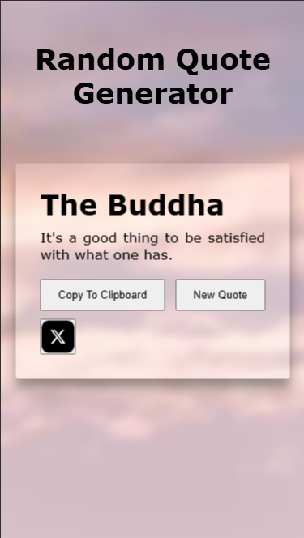

# Random Quote Generator

This is a simple Random Quote Generator that fetches quotes from an API and displays them dynamically on the web page. Users can copy quotes to their clipboard and share them on X (formerly Twitter).

## Features
- Fetches random quotes from an API
- Displays quotes dynamically on the page
- Allows users to copy quotes to clipboard
- Enables sharing quotes on X (Twitter)
- Provides a button to fetch new quotes

## Screenshots 📸



## Deployment 🌐
[Click here to use the Random Quote Generator](https://random-quote-generator-zeta-mauve.vercel.app/)

## Installation & Usage

### Steps to Run
1. Clone this repository:
   ```sh
   git https://github.com/TheVivekYadav/randomQuoteGenerator.git
   ```
2. Navigate to the project folder:
   ```sh
   cd randomQuoteGenerator
   ```
3. Open `index.html` in your preferred browser.


## Code Overview
### `getRandomQuote(url)`
Fetches a random quote from the provided API endpoint.

### `displayQuote(author, quote)`
Displays the fetched quote and author on the web page and sets up event listeners for buttons.

### `loadQuote()`
Loads a new quote by calling `getRandomQuote()` and updates the UI.

### `copyToClipBoard(content)`
Copies the given content (quote) to the clipboard.

### `shareOnX(quote, author)`
Opens X (Twitter) with a pre-filled tweet containing the quote.


